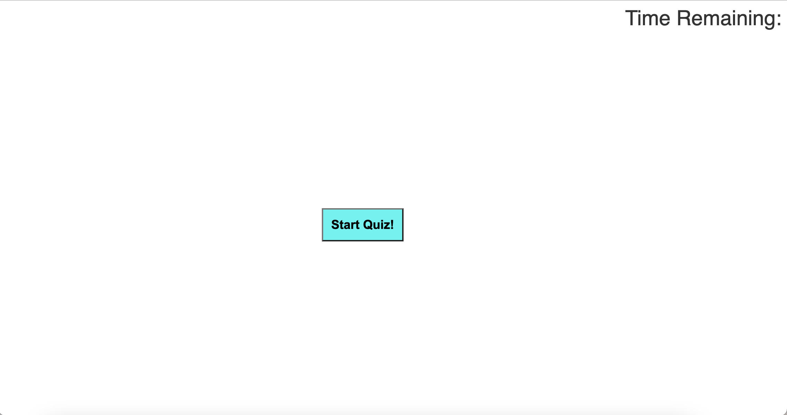
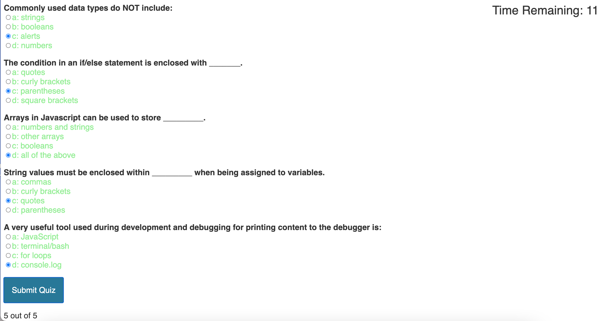

# Code-Quiz

A simple quiz to test basic understanding of coding.

## Description

Upon clicking the 'Start Quiz' button, the user will be given a timed quiz.
Click radio buttons to make selections, click submit quiz and scroll down to view score. 
If the user does not finish in the time allotted, the score will be calculated based on available input with unmarked
questions being marked incorrect.

### Dependencies

* Basic internet browser functionality

### Executing program

Press Start Quiz, click buttons next to answers, keep track of the time, press submit quiz, scroll down to view score.

## Authors

Jake Lauterstein
with assistance from a mentor: Christian Ellsworth

## Link to deployed Application

https://jakelauterstein.github.io/Code-Quiz/

## Screenshot 

## Acknowledgments

https://simplestepscode.com/javascript-quiz-tutorial/
